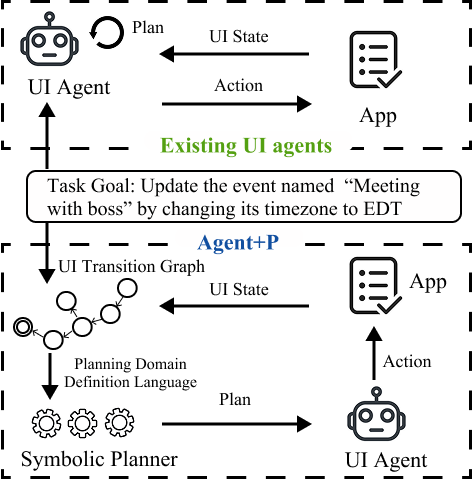

# Agent+P: Guiding UI Agents via Symbolic Planning

<div align="center">



**A novel agentic framework that leverages symbolic planning to guide LLM-based UI automation agents**

[Paper](#) | [Code](#) | [Dataset](#)

</div>

## Overview

Large Language Model (LLM)-based agents show great promise for UI automation but often hallucinate in long-horizon tasks due to their lack of understanding the navigational structure of the app. **Agent+P** addresses this fundamental limitation by combining the reasoning capabilities of modern LLMs with the reliability of symbolic planning.

Our core insight is to model an app's navigational structure as a **UI Transition Graph (UTG)**, which allows us to reformulate the UI automation task as a pathfinding problem. This enables an off-the-shelf symbolic planner to generate a provably correct and optimal high-level plan that guides the LLM agent, fundamentally eliminating planning errors.

## Key Features

- **Symbolic Planning Integration**: Leverages UI Transition Graphs (UTG) to create provably correct navigation plans
- **Plug-and-Play Design**: Works as a modular component with existing LLM agents
- **Significant Performance Gains**: Improves success rates of state-of-the-art agents by up to 12% on AndroidWorld
- **Eliminates Planning Errors**: Combines LLM flexibility with symbolic planning reliability

## Results

Agent+P demonstrates substantial improvements when evaluated on the AndroidWorld benchmark:

- ✅ Up to **12% improvement** in success rates over baseline agents
- ✅ Provably correct high-level plans that eliminate navigation errors
- ✅ Compatible with state-of-the-art LLM-based UI agents

## Installation

```bash
# Clone the repository
git clone https://github.com/yourusername/agent-plus-p.git
cd agent-plus-p

# Install dependencies
pip install -r requirements.txt
```

## Quick Start

```python
# Example usage coming soon
```

## Citation

If you find Agent+P useful in your research, please consider citing:

```bibtex
@article{agentplusp2025,
  title={Agent+P: Guiding UI Agents via Symbolic Planning},
  author={[Your Name]},
  journal={[Venue]},
  year={2025}
}
```

## License

[Add your license here]

## Contact

For questions or feedback, please [open an issue](https://github.com/yourusername/agent-plus-p/issues) or contact [your email].

---

<div align="center">
Made with ❤️ by [Your Name/Team]
</div>